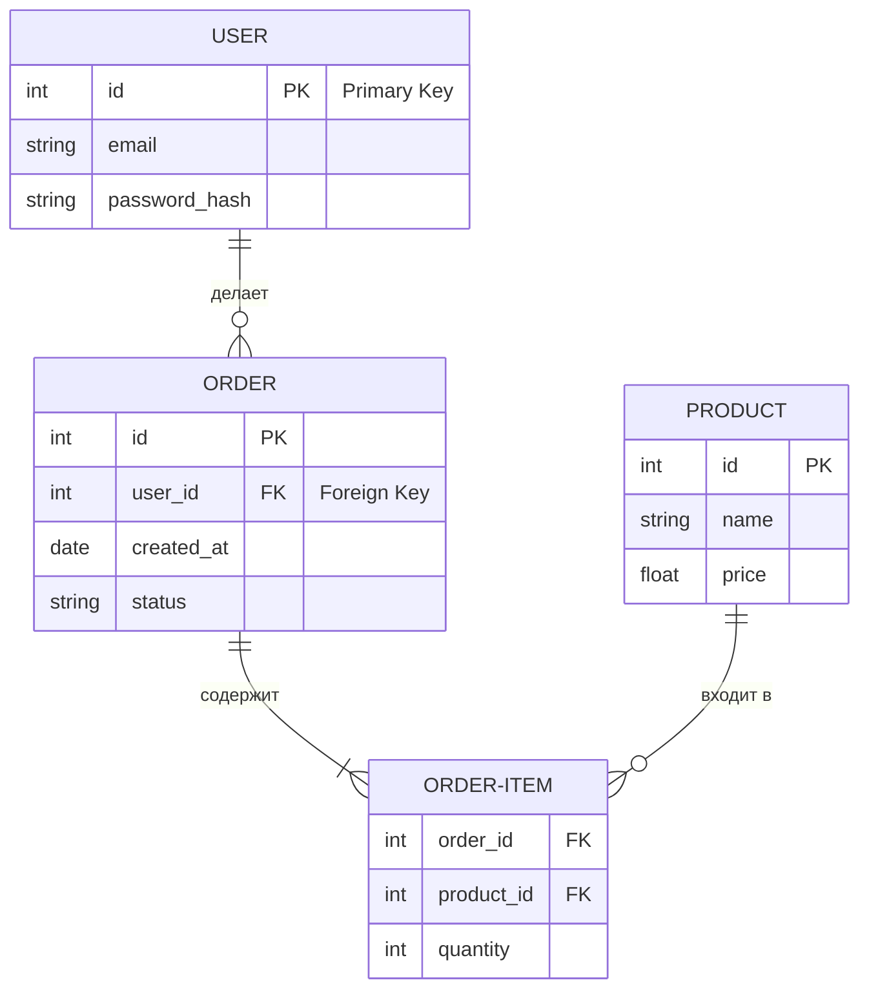

# README и ER-диаграммы: Лицо и Скелет проекта

Привет! Сегодня мы разберем два важнейших документа любого проекта.
Если код — это "мясо" программы, то:
1.  **README.md** — это **лицо** (витрина, инструкция).
2.  **ER-диаграмма** — это **скелет** (структура данных).

Без них твой проект — это черный ящик, в который страшно заглядывать.

---

## Часть 1: README.md

### Что это и зачем?
README (читается "ридми") — это первый файл, который открывает разработчик или рекрутер.
*   **Для тебя через месяц:** "Как вообще запустить эту штуку?"
*   **Для рекрутера:** "Умеет ли кандидат документировать свой код?"
*   **Для команды:** "Какую проблему решает этот проект?"

### Идеальная структура README
Держи готовый шаблон. Не нужно изобретать велосипед, следуй стандарту.

#### 1. Заголовок и Краткое описание
Ответь на вопрос: *Что это?*
> "Сервис для доставки котиков на дронах."

#### 2. Стек технологий
На чем написано? (Icons или список).
> Python, Django, PostgreSQL, Docker.

#### 3. Установка и Запуск (Самое важное!)
Пошаговая инструкция "для чайников". Команды должны копироваться и работать.

```markdown
## Установка

1. Клонируйте репозиторий:
   git clone https://github.com/user/project.git

2. Установите зависимости:
   npm install

3. Создайте .env файл:
   cp .env.example .env

4. Запустите проект:
   npm run dev
```

#### 4. Функционал
Что умеет приложение? (Маркированный список).

---

## Часть 2: ER-диаграмма (Entity-Relationship)

### Что это?
ER-диаграмма (Entity-Relationship) — это схема "Сущность-Связь". Это карта твоей базы данных.
Рисовать её нужно **ДО** того, как ты начнешь писать код моделей.

> **Правило:** 1 час проектирования БД экономит 10 часов переписывания кода.

### Три кита ER-диаграммы

1.  **Сущность (Entity)** — Это таблица в БД. Отвечает на вопрос "КТО" или "ЧТО".
    *   *Примеры:* User (Пользователь), Order (Заказ), Product (Товар).
    *   Рисуется как прямоугольник.

2.  **Атрибут (Attribute)** — Это колонка в таблице. Характеристика сущности.
    *   *Примеры:* User.email, Product.price, Order.created_at.

3.  **Связь (Relationship)** — Как таблицы общаются друг с другом.

### Типы связей (на пальцах)

#### 1. Один к одному (1:1)
Одна запись здесь соответствует ровно одной записи там.
*   *Пример:* Гражданин — Паспорт.
*   У одного человека один паспорт. У паспорта один владелец.
*   *Встречается редко.* Обычно данные просто объединяют в одну таблицу.

#### 2. Один ко многим (1:N) — Самая частая!
У одной сущности много "детей".
*   *Пример:* Автор — Книги.
*   У одного автора может быть много книг. Но у конкретной книги только один главный автор.
*   *Как реализовать:* В таблицу "Книги" добавляем колонку `author_id`.

#### 3. Многие ко многим (M:N)
Всё со всем.
*   *Пример:* Студенты — Курсы.
*   Один студент ходит на много курсов. На одном курсе сидит много студентов.
*   *Важно:* В реляционных БД (SQL) такую связь напрямую сделать нельзя!
*   *Решение:* Создается **промежуточная таблица** (например, `enrollments`), где хранятся пары `student_id` + `course_id`.

---

## Часть 3: Как рисовать (Mermaid.js)

Раньше рисовали в Paint или Visio. Сейчас модно и удобно использовать **Mermaid** — это код, который превращается в картинку прямо в Markdown (на GitHub и в Cursor это работает!).

### Шпаргалка по обозначениям ("Вороньи лапки")
*   `||` — Один и только один
*   `|{` — Один или много
*   `o|` — Ноль или один
*   `o{` — Ноль или много

### Пример диаграммы для интернет-магазина
Скопируй этот код в свой markdown-файл, чтобы увидеть магию:



### Как читать эту схему:
1.  **USER ||--o{ ORDER**: Один `USER` может иметь много `ORDER` (волнистая линия с трезубцем). Но `ORDER` всегда принадлежит одному `USER` (две палочки).
2.  **PK (Primary Key)**: Уникальный ID записи.
3.  **FK (Foreign Key)**: Ссылка на ID из другой таблицы (так создается связь).

---

## Домашнее задание
Попробуй для своего пет-проекта:
1.  Создать файл `README.md`.
2.  Описать в нем раздел "Структура базы данных".
3.  Вставить туда блок кода `mermaid` и описать 2-3 свои таблицы.
