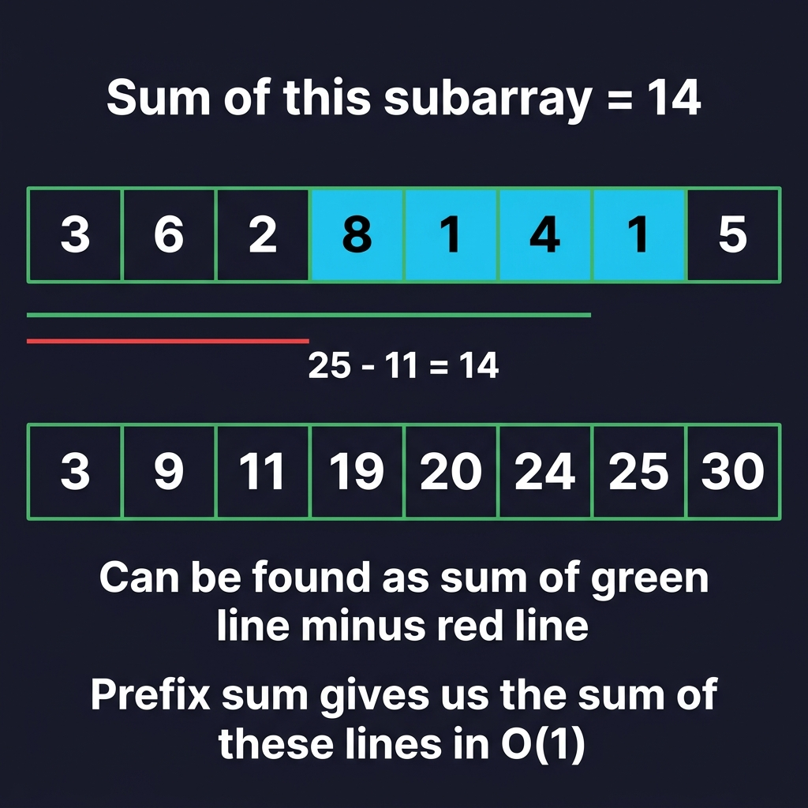

# Prefix Sum (Префиксная сумма)

Префиксная сумма — это техника, которая может применяться к массивам (обычно числовым). Идея состоит в том, чтобы создать массив `prefix`, где `prefix[i]` — это сумма всех элементов до индекса `i` (включительно). Например, для `nums = [5, 2, 1, 6, 3, 8]` мы получим `prefix = [5, 7, 8, 14, 17, 25]`.

> Когда подмассив начинается с индекса `0`, он считается «префиксом» массива. Префиксная сумма представляет собой сумму всех префиксов.

Префиксные суммы позволяют нам находить сумму любого подмассива за `O(1)`. Если мы хотим найти сумму подмассива от `i` до `j` (включительно), то ответ — `prefix[j] - prefix[i - 1]`, или альтернативно `prefix[j] - prefix[i] + nums[i]`, если вы не хотите иметь дело с выходом за границы массива, когда `i = 0`.

Это работает потому, что `prefix[i - 1]` — это сумма всех элементов **до** индекса `i`. Когда вы вычитаете это из суммы всех элементов до индекса `j`, у вас остаётся сумма всех элементов, начиная с индекса `i` и заканчивая индексом `j`, что и является тем, что мы ищем.



На изображении выше мы хотим найти сумму подмассива, выделенного синим цветом.

Если взять все элементы до конца подмассива (зелёная линия) и вычесть все элементы перед ним (красная линия), получим подмассив.

С помощью префиксной суммы мы можем найти сумму зелёной линии `25` и красной линии `11` за константное время и взять их разность, чтобы найти сумму подмассива как `14`.


Построение префиксной суммы очень просто. Вот псевдокод:

```
Given an array nums,

prefix = [nums[0]]
for (int i = 1; i < nums.length; i++)
    prefix.append(nums[i] + prefix[prefix.length - 1])
```

Изначально мы начинаем только с первого элемента. Затем мы итерируем с `i`, начиная с индекса `1`. В любой момент времени последний элемент `prefix` будет представлять сумму всех элементов входного массива до, но не включая индекс `i`. Поэтому мы можем добавить это значение плюс текущее значение в конец `prefix` и перейти к следующему элементу.

Префиксная сумма — отличный инструмент, когда задача связана с суммами подмассивов. Её построение стоит всего `O(n)`, но позволяет выполнять все последующие запросы к подмассивам за `O(1)`, поэтому она обычно может улучшить временную сложность алгоритма на множитель `O(n)`, где n — длина массива. Давайте рассмотрим несколько примеров.

> Построение префиксной суммы — это форма **предварительной обработки (pre-processing)**. Предварительная обработка — это полезная стратегия в различных задачах, где мы сохраняем предварительно вычисленные данные в структуре данных перед выполнением основной логики нашего алгоритма. Хотя предварительная обработка занимает некоторое время, это инвестиция, которая сэкономит огромное количество времени в основных частях алгоритма.

> **Пример 1:** Дан целочисленный массив `nums`, массив запросов `queries`, где `queries[i] = [x, y]`, и целое число `limit`. Верните булевый массив, который представляет ответ на каждый запрос. Запрос является `true`, если сумма подмассива от `x` до `y` меньше, чем `limit`, или `false` в противном случае.
>
> Например, для `nums = [1, 6, 3, 2, 7, 2]`, `queries = [[0, 3], [2, 5], [2, 4]]` и `limit = 13` ответ — `[true, false, true]`. Для каждого запроса суммы подмассивов равны `[12, 14, 12]`.

Давайте построим префиксную сумму и затем используем описанный выше метод, чтобы ответить на каждый запрос за `O(1)`.

Чтобы построить префиксную сумму, реализуйте приведённый выше псевдокод на языке программирования по вашему выбору.

Когда у вас есть массив префиксных сумм, вы можете найти сумму каждого подмассива, используя формулу, описанную выше. Имея сумму, сравните её с `limit`, чтобы ответить на запрос.

```python
def answer_queries(nums, queries, limit):
    prefix = [nums[0]]
    for i in range(1, len(nums)):
        prefix.append(nums[i] + prefix[-1])

    ans = []
    for x, y in queries:
        curr = prefix[y] - prefix[x] + nums[x]
        ans.append(curr < limit)

    return ans
```

Без префиксной суммы ответ на каждый запрос занял бы `O(n)` в худшем случае, где n — длина `nums`. Если `m = queries.length`, это дало бы временную сложность `O(n * m)`. С префиксной суммой её построение стоит `O(n)`, но затем ответ на каждый запрос — `O(1)`. Это даёт гораздо лучшую временную сложность `O(n + m)`. Мы используем `O(n)` памяти для построения префиксной суммы.

### Наглядный пример: сравнение подходов

Дано:
```
nums = [2, 8, 1, 4, 6, 3]
queries = [[1, 3], [0, 4], [2, 5]]
```

Каждый запрос `[l, r]` — найти сумму элементов от индекса `l` до `r`.

**❌ Без префиксной суммы — O(n) на каждый запрос:**

Для каждого запроса вручную складываем элементы:
```
Запрос [1, 3] → nums[1] + nums[2] + nums[3] = 8 + 1 + 4 = 13   (3 операции)
Запрос [0, 4] → nums[0] + nums[1] + nums[2] + nums[3] + nums[4]
              = 2 + 8 + 1 + 4 + 6 = 21                           (5 операций)
Запрос [2, 5] → nums[2] + nums[3] + nums[4] + nums[5]
              = 1 + 4 + 6 + 3 = 14                               (4 операции)
```
Итого: 12 операций сложения.

**✅ С префиксной суммой — O(1) на каждый запрос:**

Шаг 1 — строим prefix (один раз, O(n)):
```
nums   = [2, 8, 1,  4,  6,  3]
prefix = [2, 10, 11, 15, 21, 24]
```
6 операций — это фиксированная стоимость.

Шаг 2 — отвечаем на запросы (O(1) каждый):
```
Запрос [1, 3] → prefix[3] - prefix[0] = 15 - 2 = 13    (1 операция)
Запрос [0, 4] → prefix[4] = 21                           (l == 0, просто берём значение)
Запрос [2, 5] → prefix[5] - prefix[1] = 24 - 10 = 14    (1 операция)
```
Итого: 6 (построение) + 3 (запросы) = 9 операций. Сложность: `O(n + m)`.

### Что значит «худший случай» для O(n × m)?

Худший случай — это когда **каждый запрос покрывает весь массив**, то есть `[0, n-1]`:

```
nums = [2, 8, 1, 4, 6, 3]    (n = 6)

Запрос 1: [0, 5] → складываем все 6 элементов
Запрос 2: [0, 5] → опять все 6
Запрос 3: [0, 5] → и опять все 6
```

Каждый запрос — **n операций**. Если таких запросов **m**, получаем **n × m**.

А **лучший случай** — когда каждый запрос просит один элемент, например `[3, 3]`. Тогда каждый запрос — O(1), и всего O(m). Но мы не можем на это рассчитывать, поэтому оцениваем по худшему.


> **Пример 2:** [2270. Number of Ways to Split Array](https://leetcode.com/problems/number-of-ways-to-split-array)
>
> Дан целочисленный массив `nums`. Найдите количество способов разделить массив на две части так, чтобы сумма первой части была больше или равна сумме второй части. Вторая часть должна содержать хотя бы одно число.

Подход грубой силой состоял бы в итерации по каждому индексу `i` от `0` до `nums.length - 1`. Для каждого индекса итерировать от `0` до `i`, чтобы найти сумму левой части, а затем итерировать от `i + 1` до конца массива, чтобы найти сумму правой части. Этот алгоритм имел бы временную сложность `O(n²)`.

Если мы сначала построим префиксную сумму, а затем будем итерировать по каждому индексу, мы сможем вычислять суммы левой и правой частей за `O(1)`, что улучшит временную сложность до `O(n)`.

#### Наглядный пример работы со скриншота курса:
Возьмём массив:
```
nums   = [10,  4, -8,  7]
prefix = [10, 14,  6, 13]
```
Всего $n = 4$ элементов, значит допустимых точек разделения $n - 1 = 3$ (индексы $i = 0, 1, 2$):

1. **Индекс $i = 0$** (разбиение после 1-го элемента):
   - Левая часть: `[10]` $\to$ `left_section = prefix[0] = 10`
   - Правая часть: `[4, -8, 7]` $\to$ `right_section = prefix[3] - prefix[0] = 13 - 10 = 3`
   - Проверка: $10 \ge 3$ ✅ — подходит (`ans = 1`)

2. **Индекс $i = 1$** (разбиение после 2-го элемента):
   - Левая часть: `[10, 4]` $\to$ `left_section = prefix[1] = 14`
   - Правая часть: `[-8, 7]` $\to$ `right_section = prefix[3] - prefix[1] = 13 - 14 = -1`
   - Проверка: $14 \ge -1$ ✅ — подходит (`ans = 2`)

3. **Индекс $i = 2$** (разбиение после 3-го элемента):
   - Левая часть: `[10, 4, -8]` $\to$ `left_section = prefix[2] = 6`
   - Правая часть: `[7]` $\to$ `right_section = prefix[3] - prefix[2] = 13 - 6 = 7`
   - Проверка: $6 \ge 7$ ❌ — условие не выполнено

**Итого:** `ans = 2` способа.

```python
class Solution:
    def waysToSplitArray(self, nums: List[int]) -> int:
        n = len(nums)

        prefix = [nums[0]]
        for i in range(1, n):
            prefix.append(nums[i] + prefix[-1])

        ans = 0
        for i in range(n - 1):
            left_section = prefix[i]
            right_section = prefix[-1] - prefix[i]
            if left_section >= right_section:
                ans += 1

        return ans
```

## Нужен ли нам массив?

В этой задаче порядок, в котором мы обращаемся к `prefix`, является инкрементальным (постепенным): чтобы найти `leftSection`, мы обращаемся к `prefix[i]`, где `i` увеличивается на 1 каждую итерацию.

Таким образом, для вычисления `leftSection` нам на самом деле не нужен массив. Мы можем просто инициализировать `leftSection = 0` и затем вычислять его на лету, добавляя текущий элемент на каждой итерации.

А что насчёт `rightSection`? По определению, правая часть содержит все числа в массиве, которые не входят в левую часть. Поэтому мы можем предварительно вычислить сумму всего входного массива как `total`, а затем вычислять `rightSection` как `total - leftSection`.

Мы по-прежнему используем концепцию префиксной суммы, поскольку каждое значение `leftSection` представляет собой сумму префикса. Мы просто воспроизвели эту функциональность, используя целое число вместо массива.

```python
class Solution:
    def waysToSplitArray(self, nums: List[int]) -> int:
        ans = left_section = 0
        total = sum(nums)

        for i in range(len(nums) - 1):
            left_section += nums[i]
            right_section = total - left_section
            if left_section >= right_section:
                ans += 1

        return ans
```

#### Трассировка на том же примере `nums = [10, 4, -8, 7]`:
- Сначала считаем общую сумму: `total = 10 + 4 + (-8) + 7 = 13`.
- $i = 0$: `left_section = 0 + 10 = 10`, `right_section = 13 - 10 = 3` ($10 \ge 3$ ✅, `ans = 1`)
- $i = 1$: `left_section = 10 + 4 = 14`, `right_section = 13 - 14 = -1` ($14 \ge -1$ ✅, `ans = 2`)
- $i = 2$: `left_section = 14 + (-8) = 6`, `right_section = 13 - 6 = 7` ($6 \ge 7$ ❌)

Мы получаем тот же результат `ans = 2`, улучшив пространственную сложность с $O(n)$ до $O(1)$, так как больше не выделяем память под массив `prefix`.

## Заключительные замечания

Это последний крупный паттерн, который мы рассматриваем для массивов и строк. В следующей статье мы рассмотрим ещё несколько распространённых приёмов и паттернов, а затем завершим главу викториной. Перед этим попробуйте применить изученные здесь концепции в следующей задаче.
