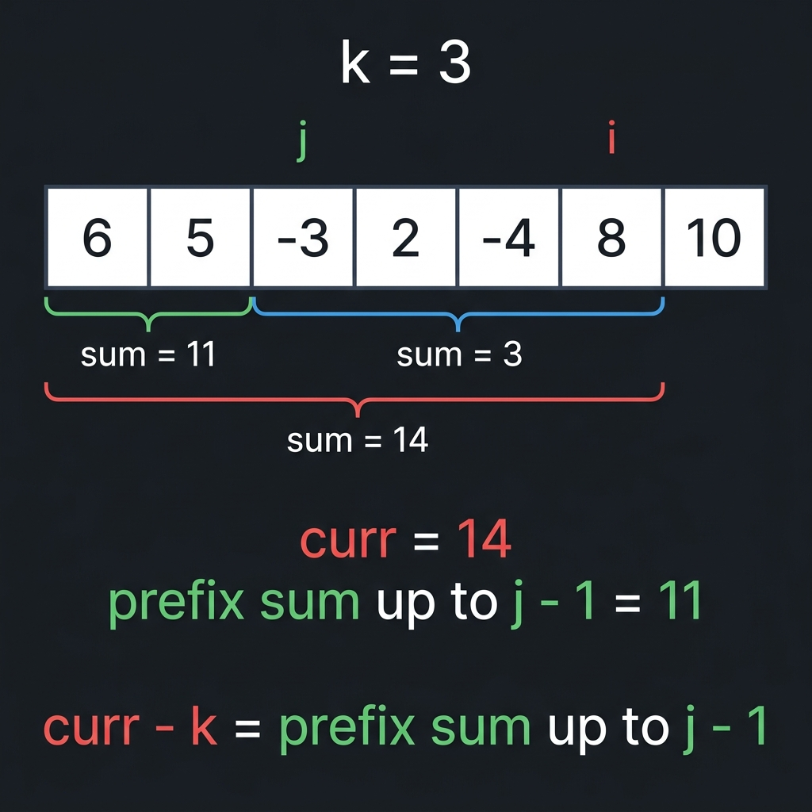

# Counting

Counting (подсчёт) — это очень распространённый паттерн с хеш-картами. Под «подсчётом» мы имеем в виду отслеживание частоты элементов. Это означает, что наша хеш-карта будет отображать ключи на целые числа. Каждый раз, когда вам нужно что-то подсчитать, думайте об использовании хеш-карты.

Вспомните, что когда мы рассматривали скользящие окна, в некоторых задачах ограничение заключалось в лимитировании количества определённого элемента в окне. Например, самая длинная подстрока с не более чем `k` нулями (`0`). В тех задачах мы могли просто использовать целочисленную переменную `curr`, потому что мы фокусировались только на одном элементе (нас интересовал только `0`). Хеш-карта открывает дверь к решению задач, где ограничение затрагивает несколько элементов. Давайте начнём с примера скользящего окна, который использует хеш-карту.

> Пример 1: Дана строка `s` и целое число `k`. Найдите длину самой длинной подстроки, которая содержит **не более** `k` различных символов.
>
> Например, при `s = "eceba"` и `k = 2`, верните `3`. Самая длинная подстрока с не более чем `2` различными символами — `"ece"`.

Эта задача работает с подстроками и имеет ограничение на подстроки (не более `k` различных символов). Эти характеристики подсказывают нам, что стоит рассмотреть скользящее окно. Помните, идея скользящего окна — добавлять элементы, сдвигаясь вправо, пока окно не нарушит ограничение. Как только это произойдёт, мы сжимаем окно слева, пока оно снова не будет удовлетворять ограничению. В этой задаче нас интересует количество различных символов в окне. Метод грубой силы для проверки этого ограничения — проверять всё окно каждый раз, что может занять O(n) времени. Используя хеш-карту, мы можем проверить ограничение за O(1).

Давайте используем хеш-карту `counts` для подсчёта символов в окне. Это означает, что мы будем отображать буквы на их частоту. Длина (количество ключей) в `counts` в любой момент времени — это количество различных символов. Когда мы удаляем слева, мы можем уменьшить частоту удаляемых элементов. Когда частота становится `0`, мы знаем, что этот символ больше не является частью окна, и мы можем удалить ключ.

```python
from collections import defaultdict

def find_longest_substring(s, k):
    counts = defaultdict(int)
    left = ans = 0
    for right in range(len(s)):
        counts[s[right]] += 1
        while len(counts) > k:
            counts[s[left]] -= 1
            if counts[s[left]] == 0:
                del counts[s[left]]
            left += 1

        ans = max(ans, right - left + 1)

    return ans
```

Как видите, использование хеш-карты для хранения частоты любого нужного ключа позволяет нам решать задачи скользящего окна, которые накладывают ограничения на несколько элементов. Мы знаем из ранее изученного, что временная сложность задач скользящего окна составляет O(n), если работа, выполняемая внутри каждой итерации цикла for, амортизированно константна, что и имеет место здесь благодаря операциям хеш-карты за O(1). Хеш-карта занимает O(k) памяти, так как алгоритм удаляет элементы из хеш-карты, как только она превышает размер k.

> Пример 2: 2248. Intersection of Multiple Arrays
>
> Дан двумерный массив `nums`, который содержит `n` массивов различных целых чисел, верните отсортированный массив, содержащий все числа, которые встречаются во всех `n` массивах.
>
> Например, при `nums = [[3,1,2,4,5],[1,2,3,4],[3,4,5,6]]`, верните `[3, 4]`. `3` и `4` — единственные числа, которые есть во всех массивах.

Условие задачи говорит, что каждый отдельный массив содержит **различные** целые числа. Это означает, что число встречается `n` раз тогда и только тогда, когда оно присутствует во всех массивах.

Давайте используем хеш-карту `counts` для подсчёта частоты элементов. Мы итерируем по каждому из внутренних массивов и обновляем `counts` каждым элементом. После прохода по всем массивам мы можем итерировать по нашей хеш-карте, чтобы увидеть, какие числа встречаются `n` раз.

```python
from collections import defaultdict

class Solution:
    def intersection(self, nums: List[List[int]]) -> List[int]:
        counts = defaultdict(int)
        for arr in nums:
            for x in arr:
                counts[x] += 1

        n = len(nums)
        ans = []
        for key in counts:
            if counts[key] == n:
                ans.append(key)

        return sorted(ans)
```

Эта задача — хороший повод обсудить, почему хеш-карта удобна. Вы можете подумать: раз наши ключи — целые числа, почему бы просто не использовать массив вместо хеш-карты? Можно, но проблема в том, что массив должен быть как минимум размером с максимальный элемент. Что если у нас тестовый случай вроде `[1, 2, 3, 1000]`? Нам нужно инициализировать массив размером `1001` (чтобы использовать `arr[1000]` для отслеживания, сколько раз встречается `1000`), и почти все индексы будут неиспользованными. Поэтому использование массива может оказаться огромной тратой памяти. Конечно, иногда это было бы более эффективно из-за накладных расходов хеш-карты, но в целом хеш-карта гораздо безопаснее. Даже если `9999999999` есть во входных данных, это не имеет значения — хеш-карта обрабатывает его как любой другой элемент.

Допустим, что есть `n` списков и каждый список имеет в среднем `m` элементов. Для заполнения нашей хеш-карты нужно O(n · m) для итерации по всем элементам. Следующий цикл итерирует по всем уникальным элементам, которые мы встретили. Если все элементы уникальны, это может стоить до O(n · m), хотя это не повлияет на нашу временную сложность, так как предыдущий цикл тоже стоил O(n · m). Наконец, в `ans` может быть не более `m` элементов, когда мы выполняем сортировку, что означает, что в худшем случае сортировка будет стоить O(m · log m). Это даёт нам временную сложность O(n · m + m · log m) = O(m · (n + log m)). Если каждый элемент во входных данных уникален, то хеш-карта вырастет до размера n · m, что означает, что алгоритм имеет пространственную сложность O(n · m).

> Пример 3: 1941. Check if All Characters Have Equal Number of Occurrences
>
> Дана строка `s`, определите, имеют ли все символы одинаковую частоту.
>
> Например, при `s = "abacbc"`, верните true, потому что все символы встречаются дважды. При `s = "aaabb"`, верните false. `"a"` встречается 3 раза, `"b"` встречается 2 раза. `3 != 2`.

Используя наши знания о хеш-картах и множествах, это простая задача. Используйте хеш-карту `counts` для подсчёта частоты всех символов. Пройдите по `s` и получите частоту каждого символа. Проверьте, одинаковы ли все частоты.

Поскольку множество игнорирует дубликаты, мы можем поместить все частоты во множество и проверить, равна ли длина `1`, чтобы убедиться, что все частоты одинаковы.

```python
from collections import defaultdict

class Solution:
    def areOccurrencesEqual(self, s: str) -> bool:
        counts = defaultdict(int)
        for c in s:
            counts[c] += 1

        frequencies = counts.values()
        return len(set(frequencies)) == 1
```

При `n` как длине `s`, заполнение хеш-карты стоит O(n), затем O(n) для преобразования значений хеш-карты во множество. Это даёт нам временную сложность O(n). Пространство, которое займут хеш-карта и множество, равно количеству уникальных символов. Как обсуждалось ранее, некоторые утверждали бы, что это O(1), так как символы из английского алфавита, который ограничен константой. Более общий ответ — сказать, что пространственная сложность составляет O(k), где k — количество символов, которые могут быть во входных данных, что в данной задаче равно 26.

Бонусный однострочник на Python с использованием Counter из collections:

```python
from collections import Counter

class Solution:
    def areOccurrencesEqual(self, s: str) -> bool:
        return len(set(Counter(s).values())) == 1
```

---

## Подсчёт количества подмассивов с «точным» ограничением

В статье о скользящем окне из главы 1 мы говорили о паттерне «найти количество подмассивов/подстрок, которые удовлетворяют ограничению». В тех задачах, если у вас было окно между `left` и `right`, которое удовлетворяло ограничению, то все окна от `i` до `right` тоже удовлетворяли ограничению, где `left < i <= right`.

Для этого паттерна мы будем рассматривать задачи с более строгими ограничениями, так что вышеупомянутое свойство не обязательно верно.

> Например, «Найти количество подмассивов с суммой меньше k» с входными данными, которые **содержат только положительные числа**, решалось бы скользящим окном. В этом разделе мы будем говорить о вопросах вроде «Найти количество подмассивов с суммой **точно равной** `k`».

На первый взгляд, некоторые из этих задач могут показаться очень сложными. Однако паттерн очень прост, как только вы его изучите, и вы увидите, насколько похож код для каждой задачи, попадающей в этот паттерн. Чтобы понять алгоритм, нам нужно вспомнить концепцию префиксных сумм.

Сумма любого подмассива может быть найдена как разность между двумя префиксными суммами. Допустим, вы хотели найти подмассивы с суммой, точно равной `k`, и у вас также был массив префиксных сумм входных данных. Вы знаете, что любая разность в массиве префиксных сумм, равная `k`, представляет подмассив с суммой, равной `k`. Так как же найти эти разности?

Давайте сначала объявим хеш-карту `counts`, которая отображает префиксные суммы на то, как часто они встречаются (число может появляться несколько раз в префиксной сумме, если входные данные содержат отрицательные числа или нули, например, при `nums = [1, -1, 1]`, префиксная сумма равна `[1, 0, 1]` и `1` встречается дважды). Нам нужно инициализировать `counts[0] = 1`. Это потому, что пустой префикс `[]` имеет сумму `0`. Вы увидите, почему это необходимо, через секунду.

Теперь давайте итерировать по входным данным и поддерживать сумму текущего префикса в переменной `curr`. В любой момент времени `curr` представляет сумму всех элементов, по которым мы уже прошли. Мы также будем поддерживать `counts`, увеличивая частоту `curr` на каждой итерации. Помните, `counts` подсчитывает, сколько раз сумма появилась в префиксе.

Главный вопрос: как вычислить ответ? Вспомните, что в статье о скользящем окне, когда мы искали «количество подмассивов», мы фокусировались на каждом индексе и определяли, сколько валидных подмассивов **заканчивается** на текущем индексе. По сути, мы фиксировали правую границу и вычисляли, сколько левых границ могут ей соответствовать. Мы будем делать то же самое здесь. Допустим, мы находимся на индексе `i`. Мы знаем несколько вещей:

1. До этого момента `curr` хранит префикс всех элементов до `i`.
2. Мы сохранили все остальные префиксы до `i` внутри `counts`.
3. Разность между любыми двумя префиксными суммами представляет подмассив. Например, если вы хотели подмассив, начинающийся с индекса `3` и заканчивающийся на индексе `8`, вы бы взяли префикс до `8` и вычли префикс до `2` из него.

Теперь представьте, что существует подмассив, начинающийся с индекса `j` и заканчивающийся на индексе `i` с суммой `k`. Рассмотрим сумму префикса, заканчивающегося на `j - 1` (элементы до, но не включая начало подмассива). Согласно нашим допущениям:

- Сумма префикса до `i` равна `curr`.
- Сумма подмассива от `j` до `i` равна `k`.

Таким образом, сумма префикса, заканчивающегося на `j - 1`, должна быть `curr - k`.



На этом изображении подмассив между `j` и `i` имеет сумму `k`. Сумма префикса, заканчивающегося на `i`, равна `14` (что мы отслеживаем в `curr`).

В какой-то момент ранее `curr` был равен `11` (префикс, заканчивающийся перед `j`). Это равно `curr - k`.

Это ключевая идея: если мы видели префиксную сумму `curr - k` ранее, это **обязательно означает**, что существует подмассив, заканчивающийся на `i` с суммой `k`. Мы не знаем, где начало этого подмассива; мы просто знаем, что он существует, но этого достаточно для решения задачи.

Поэтому мы можем увеличить наш ответ на `counts[curr - k]`. Если префикс `curr - k` встречался несколько раз ранее (из-за отрицательных чисел или нуля), то каждый из этих префиксов может быть использован как начальная точка для формирования подмассива, заканчивающегося на текущем индексе с суммой `k`. Вот почему нам нужно отслеживать частоту.

> Давайте используем конкретный пример, чтобы лучше проиллюстрировать эту идею. Представьте, что у нас `nums = [0, 1, 2, 3, 4]` и `k = 5`. Перейдём к `i = 3`.
>
> Сейчас `curr = 6` (помните, `curr` отслеживает префиксную сумму до `i`). У нас также есть `0`, `1` и `3` в `counts` (все префиксные суммы, которые мы встретили до сих пор).
>
> На этом этапе мы видим, что существует подмассив, заканчивающийся на `i` с суммой `k` — это `[2, 3]`. Но как наш алгоритм это видит?
>
> Текущая префиксная сумма равна `6`. Мы хотим подмассив с суммой `5`. Таким образом, если ранее была префиксная сумма `1`, вы могли бы просто вычесть этот префикс из текущего, и вы получите сумму подмассива `5`. В данном случае у нас был префикс `[0, 1]`, который имеет префиксную сумму `1`. Мы можем вычесть его из текущего префикса `[0, 1, 2, 3]`, и у нас останется `[2, 3]`, что имеет нашу целевую сумму.

Вспомните задачу 1. Two Sum, мы искали `target`. Мы фиксировали число `num` и искали `target - num`. Здесь мы фиксируем `curr` и ищем `curr - k`, потому что `curr - (curr - k) = k`. В Two Sum мы работали с числами в массиве напрямую. Здесь мы работаем с префиксными суммами массива.

> Пример 4: 560. Subarray Sum Equals K
>
> Дан массив целых чисел `nums` и целое число `k`, найдите количество подмассивов, сумма которых равна `k`.

Давайте разберём пример, чтобы увидеть, почему описанный выше алгоритм работает для этой задачи. Допустим, у нас `nums = [1, 2, 1, 2, 1]`, `k = 3`. Есть четыре подмассива с суммой `3` — `[1, 2]` дважды и `[2, 1]` дважды.

Префиксная сумма для этих входных данных, то есть то, что `curr` представляет во время итерации, равна `[1, 3, 4, 6, 7]`. Вы можете видеть, что в этом массиве есть три разности, равные `3`: `(4 - 1)`, `(6 - 3)`, `(7 - 4)`.

Но мы сказали, что есть четыре валидных подмассива? Вспомните, что нам нужно инициализировать нашу хеш-карту с `0: 1`, учитывая пустой префикс. Это потому, что если есть префикс с суммой, равной `k`, то без инициализации `0: 1`, `curr - k = 0` не появится в хеш-карте, и мы «потеряем» этот валидный подмассив.

Итак, на индексах 1, 2, 3 и 4 мы находим, что `curr - k` уже встречался ранее. Все элементы положительные, поэтому каждое значение `curr - k` встретилось только один раз, и, следовательно, наш ответ — `4`.

```python
from collections import defaultdict

class Solution:
    def subarraySum(self, nums: List[int], k: int) -> int:
        counts = defaultdict(int)
        counts[0] = 1
        ans = curr = 0

        for num in nums:
            curr += num
            ans += counts[curr - k]
            counts[curr] += 1

        return ans
```

Вы можете подумать: если `curr` только увеличивается, то ни одно значение в хеш-карте не больше 1, нельзя ли просто использовать множество? Это было бы верно, если бы массив содержал только положительные числа — однако ограничения говорят `-1000 <= nums[i] <= 1000`. Давайте подумаем о примере: `nums = [1, -1, 1, -1]`, `k = 0`. Есть четыре валидных подмассива: `[1, -1]` дважды, `[-1, 1]` один раз, и весь массив `[1, -1, 1, -1]`.

Префиксная сумма равна `[1, 0, 1, 0]`. На последнем индексе заканчиваются два подмассива — `[1, -1]` и весь массив. Помните, что мы инициализируем `counts[0] = 1`, поэтому после второго индекса у нас `counts[0] = 2`. Когда мы доходим до последнего индекса и выполняем `ans += counts[curr - k] = ans += counts[0]`, мы добавляем оба подмассива к нашему ответу. Когда во входных данных есть неположительные числа, **один и тот же префикс может встречаться несколько раз**, и хеш-карта нужна для подсчёта частоты.

Подведём итог:

- Мы используем `curr` для отслеживания префиксной суммы.
- На любом индексе `i` сумма до `i` равна `curr`. Если существует индекс `j`, чей префикс равен `curr - k`, то сумма подмассива с элементами от `j + 1` до `i` равна `curr - (curr - k) = k`.
- Поскольку массив может содержать отрицательные числа, один и тот же префикс может встречаться несколько раз. Мы используем хеш-карту `counts` для отслеживания, сколько раз префикс встречался.
- На каждом индексе `i` частота `curr - k` равна количеству подмассивов, сумма которых равна `k`, заканчивающихся на `i`. Добавляем это к ответу.

Временная и пространственная сложность этого алгоритма обе составляют O(n), где n — длина `nums`. Каждая итерация цикла for выполняется за константное время, и хеш-карта может вырасти до размера n элементов.

> Пример 5: 1248. Count Number of Nice Subarrays
>
> Дан массив положительных целых чисел `nums` и целое число `k`. Найдите количество подмассивов, содержащих ровно `k` нечётных чисел.
>
> Например, при `nums = [1, 1, 2, 1, 1]`, `k = 3`, ответ — `2`. Подмассивы с `3` нечётными числами — это `[1, 1, 2, 1, 1]` и `[1, 1, 2, 1, 1]`.

В предыдущем примере метрика ограничения была суммой, поэтому `curr` записывал префиксную сумму. В этой задаче метрика ограничения — **количество нечётных чисел**. Поэтому давайте `curr` будет отслеживать количество нечётных чисел. На каждом элементе мы можем снова запрашивать `curr - k`. В примере тестового случая, на последнем индексе `curr = 4`, потому что в массиве `4` нечётных числа. На первом индексе `curr = 1`. Это означает, что подмассив, начинающийся после первого индекса и до последнего индекса, имеет `4 - 1 = 3 = k` нечётных чисел, и вы можете видеть, что подмассив от индекса `1` до `4` — один из ответов ( `[1, 1, 2, 1, 1]` ).

> Мы можем проверить, является ли число нечётным, взяв его по модулю 2. Если `x` нечётное, то `x % 2 = 1`.

```python
from collections import defaultdict

class Solution:
    def numberOfSubarrays(self, nums: List[int], k: int) -> int:
        counts = defaultdict(int)
        counts[0] = 1
        ans = curr = 0

        for num in nums:
            curr += num % 2
            ans += counts[curr - k]
            counts[curr] += 1

        return ans
```

Временная и пространственная сложность этого алгоритма идентична предыдущей задаче (O(n) для обоих) по тем же причинам. Помните, когда мы говорили: «вы увидите, насколько похож код для каждой задачи, попадающей в этот паттерн»? Две разные задачи, и разница в коде составляет **буквально** 2 символа, `" % 2 "`. Обратите внимание, что хотя не все задачи, следующие этому паттерну, будут использовать идентичный код, все они будут очень похожими.

